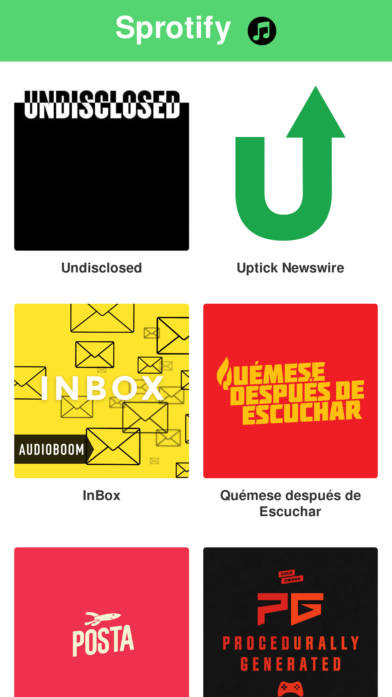

# Sprotify

Esta es la app de sprotify, creada con el fin de ejemplificar la integración de **NextJS** en un proyecto de react. Esta elaborada con el soporte de la API de audioboom.

## ¿Cómo funciona?

**Requiere Node JS 10**

 * `npm install` para instalar las dependencias
 * `npm run dev` para lanzar la app
 
## Demo Live con Now

https://sprotify-57pqcokyu.now.sh/
